Performance testing screenshots

1. test_plan_1.jmx
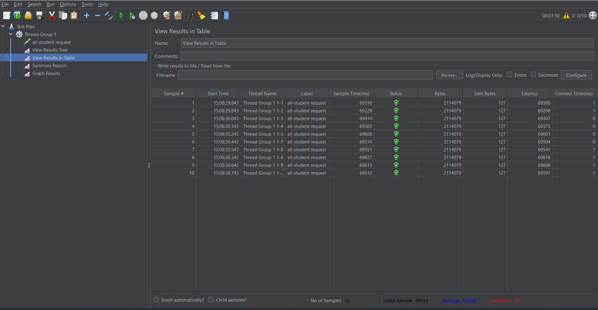
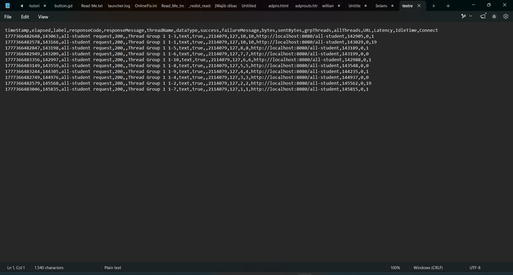

2. test_plan_2.jmx
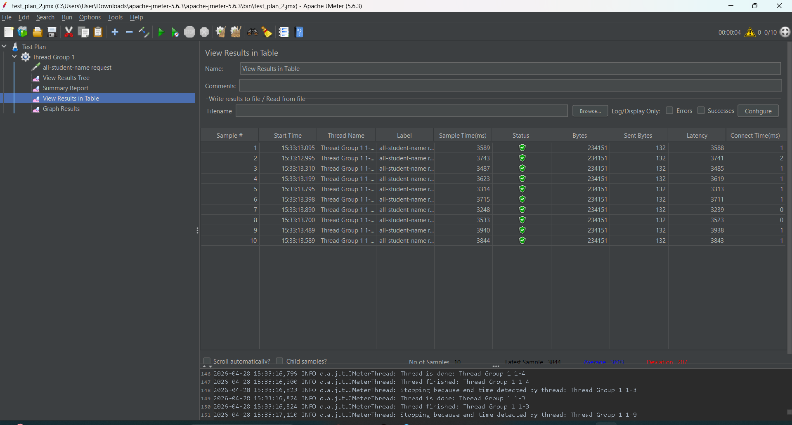
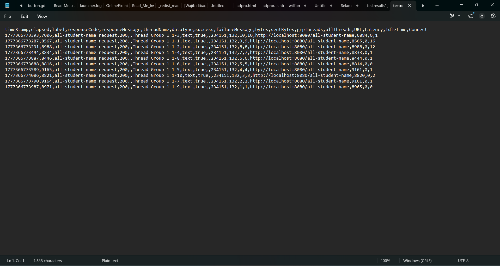

3. test_plan_3.jmx
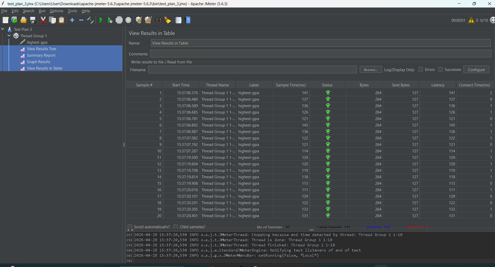
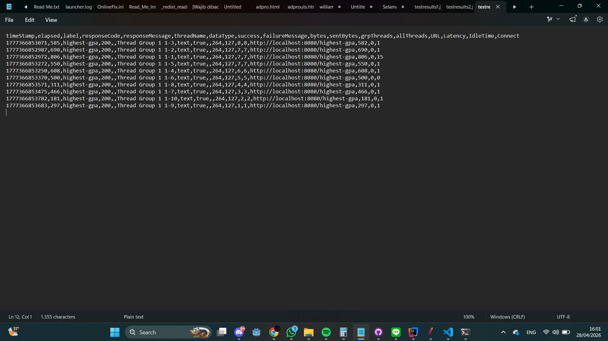

## Profiling and Performance Optimization

### 1. `getAllStudentsWithCourses` Endpoint
- **Before Optimization:** 4,179 ms
- **After Optimization:** 1,758 ms
- **Improvement:** 2,421 ms (Faster by **`~58%`**)

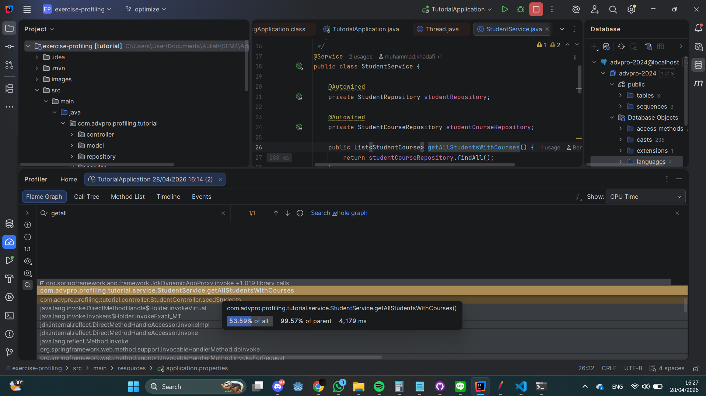
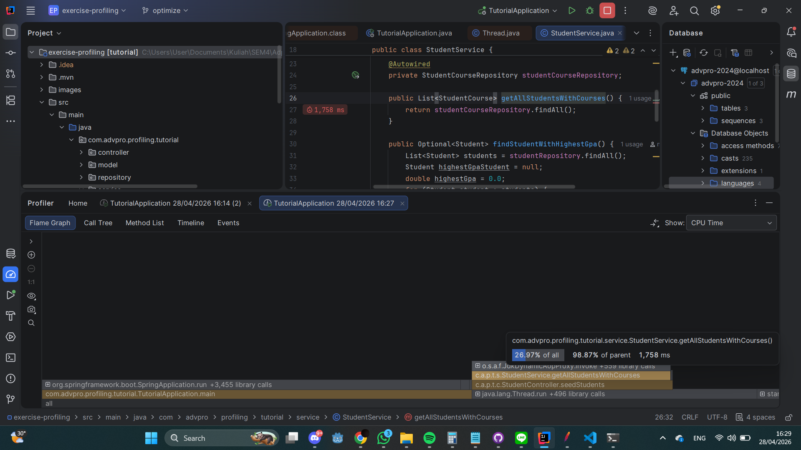

### 2. `joinStudentNames` Endpoint
- **Before Optimization:** 710 ms
- **After Optimization:** 304 ms
- **Improvement:** 406 ms (Faster by **`~57%`**)

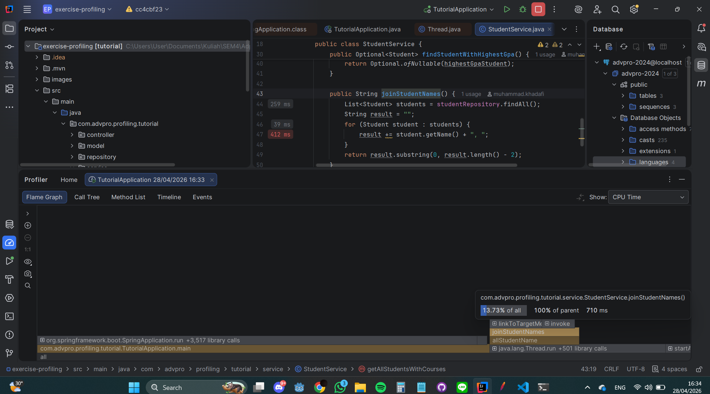
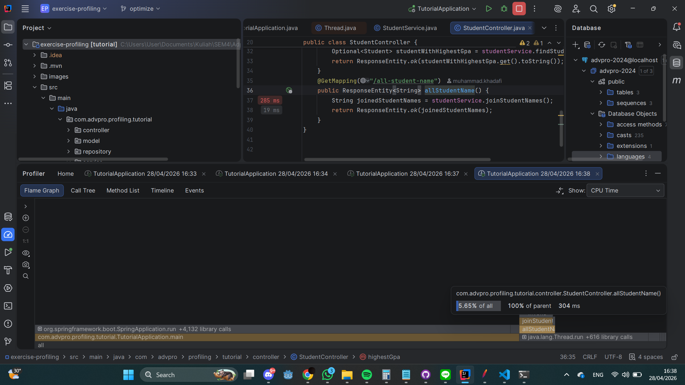

### 3. `findStudentWithHighestGpa` Endpoint
- **Before Optimization:** 234 ms
- **After Optimization:** 152 ms
- **Improvement:** 82 ms (Faster by **`~35%`**)

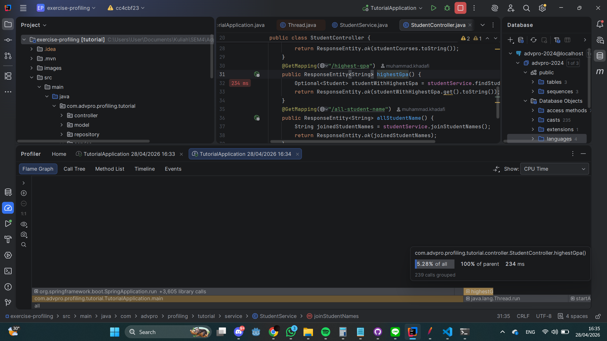
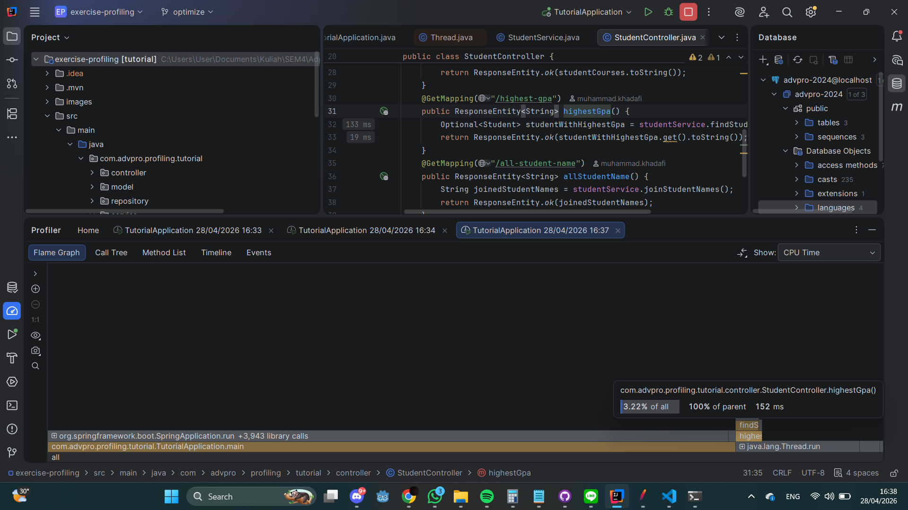

### Conclusion
As observed from the profiling results above, the initial implementations suffered from heavy memory usage and excessive database hits (such as the N+1 problem and creating a large number of internal loops natively in Java). 

The refactoring process pushed the heavy lifting down to the database level (employing built-in JPA repository queries) and leveraged smarter native data streams (like Java 8 `Collectors.joining`). This significantly reduced execution times across the board—producing performance boosts between **35% and 58%**, which easily exceeds the >20% requirement target. Consequently, the application operates faster, uses computational resources more efficiently, and provides a much more responsive user experience overall.

